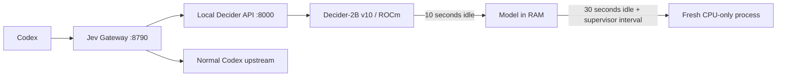

# Jev / Decider on Windows ROCm

[日本語](README.jp.md) · [Architecture](docs/architecture.md) · [Measurements](docs/validation.md)

Run **Decider-2B v10** behind [Jev Gateway](https://github.com/vinilana/jev-gateway) on a Windows AMD GPU, without keeping its GPU allocation resident all day.

This independent integration stores large linear weights as **INT8**, computes in **BF16**, offloads the model to RAM after 10 seconds without GPU work, and recycles the GPU process after 30 seconds. A fresh service then waits in RAM. The model checkpoint stays unchanged.

On one **RX 9070 XT**, the old resident service used **6.18 GiB** of Windows dedicated GPU memory. The new service measured **3.11–3.70 GiB while resident** and **0 MiB after process recycling**. These are observed samples, not a guaranteed peak budget.

**The tradeoff: the first GPU request after full release took 25.8 seconds to initialize.** During preparation, the gateway falls back to the main Codex model. This configuration prioritizes idle VRAM. It is not a demonstrated end-to-end speedup.

## Flow



One dedicated worker serializes GPU work. Busy requests return HTTP 503, and oversized requests return HTTP 413. The gateway delegates those requests to Codex. Confidence and model answers are not rewritten; direct tool execution is disabled.

## Prerequisites

- Windows and an **already working GPU-specific ROCm/PyTorch environment**. Hardware results here cover only RX 9070 XT / gfx1201.
- Python 3.12 with [Mapika/decider](https://github.com/Mapika/decider), Transformers, FLA and compatible Triton installed. The tested Decider source commit is recorded in [the benchmark](benchmarks/2026-09-22-rx9070xt.json).
- `Mapika/decider-2b` **v10** already cached in Hugging Face. The service loads offline and checks the model's version. It does not download or redistribute weights.
- Node.js and Jev Gateway (`npm install -g jev-gateway@0.4.1` was the tested version).
- Codex authenticated through its normal sign-in flow.

Install only the missing HTTP dependencies into that environment:

```powershell
& 'D:\AI\decider\.venv\Scripts\python.exe' -m pip install -r requirements-service.txt
```

The example paths are placeholders. This repository does not install GPU drivers or replace torch/Triton. See [the exact tested versions and limits](docs/validation.md).

## Install

If updating an existing installation, stop its local service and gateway first. `jev-local stop` leaves the gateway running; use `jev-codex --stop` before changing gateway settings.

Preview the changes:

```powershell
.\scripts\Install.ps1 `
  -PythonPath 'D:\AI\decider\.venv\Scripts\python.exe' `
  -DeciderDirectory 'D:\AI\decider' `
  -RegisterLogonTask -WhatIf
```

Then install:

```powershell
.\scripts\Install.ps1 `
  -PythonPath 'D:\AI\decider\.venv\Scripts\python.exe' `
  -DeciderDirectory 'D:\AI\decider' `
  -RegisterLogonTask -StartNow
```

The installer copies the service into `%USERPROFILE%\.jev-gateway\local`, creates machine-specific configuration, merges the local settings from [.env.example](.env.example), and backs up files it replaces. Existing nonempty TypeSafe keys and unrelated environment entries are preserved. The example key is a literal local placeholder, not a cloud credential.

`-RegisterLogonTask` creates the non-elevated **Jev Local Decider** task for the current user's sign-in. `-StartNow` starts it now. Omit both switches to install files and configuration only. `-StateDirectory`, `-NodePath`, and `-GatewayLauncher` support nondefault paths.

The installer's file generation, backup, environment merge and quoting are tested in a temporary fixture. A complete clean-machine driver/model installation is not covered by these tests.

### Connect Codex

Merge the following into your existing `%USERPROFILE%\.codex\config.toml`, preserving your other settings:

```toml
model_provider = "jev-gateway"

[model_providers.jev-gateway]
name = "Jev Gateway"
base_url = "http://127.0.0.1:8790/v1"
wire_api = "responses"
requires_openai_auth = true
```

The installer does not edit Codex authentication or its configuration. The gateway upstream is `https://chatgpt.com/backend-api/codex`. Restart an already-running gateway after its `.env` changes, and reload Codex configuration as needed. Existing installations already using this provider need no additional provider entry.

## Operate

```powershell
$jev = Join-Path $env:USERPROFILE '.jev-gateway\local\jev-local.ps1'
& $jev status
& $jev dashboard
& $jev stop
& $jev start
& $jev restart
```

`ready: true`, `phase: idle`, and `gpu_resident: false` mean normal RAM standby. After full recycling the next GPU request is cold. `stop` persists across sign-ins until `start` removes the pause marker. The passthrough gateway remains available while the local model is stopped.

The defaults in `installation.json` are `precision: int8`, `idle_seconds: 10`, and `deep_idle_seconds: 30`. `precision: bf16` restores unquantized linear weights with higher active VRAM. Keep the deep-idle threshold longer than the offload threshold.

## Validation

The original hardware run covered real API requests, gateway dry decisions, concurrency, rejection, RAM resume, scheduled-task startup, process replacement and Windows GPU counters. A synthetic comparison of **22 cases / 37 questions** preserved every choice label and the checked confidence bins; probabilities were not identical. See [validation details](docs/validation.md).

Run the portable regression suite in the working environment:

```powershell
& 'D:\AI\decider\.venv\Scripts\python.exe' -m pip install -r requirements-test.txt
& 'D:\AI\decider\.venv\Scripts\python.exe' -m unittest discover -s tests -v
.\tests\Test-Installer.ps1
```

GitHub Actions runs CPU tests on Windows. It does **not** validate ROCm compatibility, GPU latency or VRAM. The Decider-specific padding test is skipped when Decider is absent.

To inspect the running service without executing any chosen tools:

```powershell
& 'D:\AI\decider\.venv\Scripts\python.exe' scripts\probe_service.py
```

The optional `scripts/fp8_probe.py` tests upstream's native FP8 linear primitive on the current GPU. Run it separately from other GPU workloads. Native FP8 failed in the measured Windows ROCm build; no GGUF backend or 0.8B model switch is included.

## Scope and license

This repository contains the integration code, setup script, tests and sanitized measurement summaries. It contains no model weights, credentials, local machine configuration or conversation logs. The original installation's paths are not required.

Apache-2.0; see [LICENSE](LICENSE) and [NOTICE](NOTICE). Decider and Jev Gateway retain their own licenses. This is not an official TypeSafe/Jev, Mapika or AMD release.
